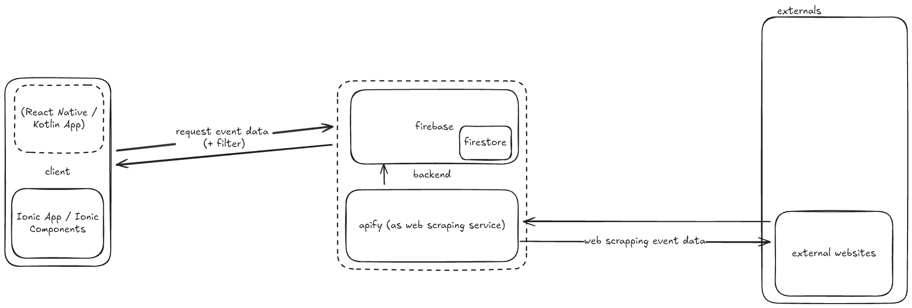

<h1>Connect</h1>

# ✨ Introduction

Connect is an App aimed to provide a central place for events in your area. The information about events and activities hosted by your city or county is often scattered across their multiple websites and manually locking each one up looking for something interesting is time consuming and tidious.

# 👥 Contributing

The current implementation uses actors for each region to scrape the event data from your local cities or counties website. The logic is therefore custom for each Site.
If you want to contribute by creating a scraping actor for your region this guide will help you.

## Creating your own actor

1. See `/actors`
2. Copy the actor template and follow the quick start guide in the templates README.

# 🔧 Future Improvements

_This is a list representing possibble future improvements to the app. There's no guaranty on them beeing implemented._

- [ ] Categorizing events using ai
- [ ] Enable creating your own events
- [ ] Friend system enabling you to see the events your friends will go to

# 🏗️ Architecture

The above diagramm represents the current architecture of the application.

- **Apify** is used as a web scraping platform to get the data necessary for the app
- **Firebase** is used as a storage and authentification solution
- The **Ionic Framework** ensures that the apps frontend is deployable on multiple platforms
